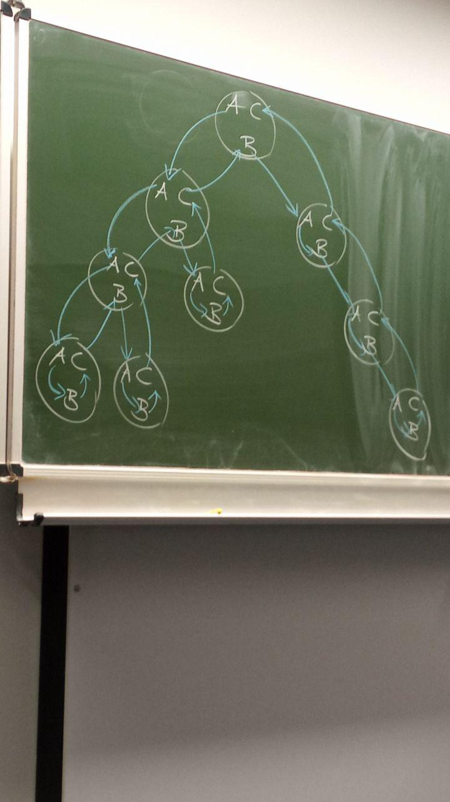
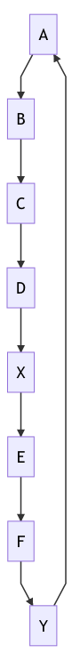

### Grundlegende Algorithmen und Datenstrukturen - Vorlesung 1 14. Oktober 2019

Zweiwöchentliche Übung (3V+1Ü), 4SWS VL, die Übung geradwöchig Montags.  

---
####Algorithmenanalyse
- Performanzanalyse
- Korrektheit
- Robustheit
- Simplizität
- Wartbarkeit
- Einfachheit

Tarjan: Algorithmus muss einfach sein, die Analyse darf kompliziert sein.

Beispiel: Union-Find  
Verwalte Partitionen einer Grundmenge unter Operationen
  - Union(Find(x), Find(y))
  - Find(x)  
ausgehend von Singleton

Satz: Folge von m UNION und FIND Operationen hat Kosten :  
O((n+m)* $\alpha(n)$)

$\alpha(n)$: Inverse zur Ackermannfunktion A(u,v)

$\alpha(n)$: min x, so dass  A(x,x) = n  
"praktisch" Konstant

$log^* n$: min K, sodass $log^{(k)}n \geqslant 2$

#### Algorithmentheorie
 *Worst-Case Analyse:*  
-> Performanzgarantie  
*Alternative:*
-average-Case  
-> Verteilung notwendig  
-> kompliziert  

*Smooth Analysis*

*asymptotische Analyse:* mit O-Notation  
f(n) = O(g(n))

$O(g(n)) = \{h(n)| \exists c > 0 \exists n_0$, sodass  
  für alle n $\geq n_0$ gilt
  $h(n) \leq c * g(n) \}$


$\Omega(g(n))$

$\alpha(n) = O(log^* n)$

$2^{2 log n}$

### GADS Vorlesung 2 18.Oktober 2019

Nachtrag:

o(g(n)) = $\{f(n): \forall c > 0
          \exists n_0>0 \text{ so dass }   \\
          0 \leq f(n) < c * g(n)\\
          \text{ für alle n }\geq n_0\} \\
          w(g(n) = \{f(n) : \forall c > 0 \\ \exists  n_0 > 0  \text{ so dass\\ }\leq c * g(n))  < f(n)\\\text{ für  alle n }\geq n_0\}$

####<u> Sortieren</u>

Vergleichsbasiert in Zeit O(n log n) für n Elemente, falls Vergleich Kosten O(1) hat,
bspw. mit   

  - Mergesort
  - Heap Sort

im schlechtesten Fall

Quicksort hat im schlechtesten Fall Laufzeit
$\Theta$(n^2)  
Geht es vergleichsbasiert schneller?  

Zu jedem vergleichsbasierten Sortieralgorithmus existiert ein Vergleichsbaum

sortiere $a_1...a_n$

      Bsp. für a1,a2,a3
                            a1 <= a2?
                    a1 <= a3?       
                    /       \                 
              a2 <= a3?      a3<=a1<=a2
              /   \
    a1<=a2<=a3  a1<=a3<=a2

    Unvollständig, da zu blöd. Gidf

"Zwischenknoten" sind Vergleichsknoten, Blätter sind mit Sortierungspermutation, also quasi Reihenfolge beschriftet.


Vergleichsbaum muss (min.) $n!$ Blätter haben, wobei n! Anzahl der Permutationen von n Elementen ist.
Mindestens, da Algorithmus evtl. unnötige Vergleiche durchführt.

Tiefe eines Blattes im Baum entspricht der Anzahl der Vergleiche auf dem Weg zum Blatt.

Schlechteste Fall für Anzahl Vergleiche :=  Tiefe des Tiefsten Blattes im Baum = Höhe des Baums

    Höhe        max. Anzahl Blätter
    0           1
    1           2
    2           4
    h           2^h

Vergleichsbaum Höhe h  
  $2^h \geq n!$  
  $log_2 2^h \geq log_2 n!$  
  $h\geq log(n!)$<-- worst case Anzahl Vergleiche

  Was ist log(n!)?

  $(n)* (n-1)* (n-2) ...{n\over 2}... 3* 2* 1$

  ${n\over2}^{n\over2} \leq n! \leq n^n$  
  $log(n^n) = n log(n)$

  n gerade:
  $log({n\over2}^{n\over2}) = {n\over2} * log({n\over2})= {n\over2}* (log n-1)$  
  Also:  

  log(n!) = $\Omega$(n log n)  
  log(n!) = O(n log n)

####<u>Sortieren in linearer Zeit</u>
Sortiere ganze Zahlen aus dem Bereich $\{1,2,3,...,k\}$,  
 gegeben in Feld A[1...n]
Ausgabe sortiert in Feld B[1..n],  
 stabil:Gleiche Werte in Ausgabe B in gleicher Reihenfolge wie in Eingabe A.

###### Counting Sort:
    Algorithmus
    Feld C[1..k]
    for  i = 1 to K             A: 2|4|3|2|4|5|1|6   
    do C[i] = 0;                k=7
    for i= 1 to n                  1 2 3 4 5 6 7 8
    do C[A[j]] = C[A[j]] + 1;   C: 1|2|1|2|1|1|0|0
    for i = 2 to k                 1 2 3 4 5 6 7 8
    do C[i] = C[i] + C[i-1];    B: 1|2|2|3|4|4|5|6
    for j=n downto 1
    do B[C[A[j]]] = A[j]
       C[A[j]] = C[A[j]] - 1

Laufzeit aller Schleifen: $\Theta(n+k)$

Counting Sort ist nicht vergleichsbasiert! Daher gilt untere Schranke von n log n nicht.

Sortiere Paare aus [1..k]x[1..k]  lexikographisch

Idee: Sortiere zuerst nach zweiter Komponente,dann nach erster. Da zweite Komponente bereits sortiert ist und Countingsort stabil ist, bleibt korrekte Reihenfolge der zweiten Komponente erhalten, aber erste wird sortiert.

###GADS Vorlesung 3 21.Oktober 2019

[CLRS] -> Buch zu Algorithmen: "Introduction to Algorithms"

Heapsort

Binärer Baum implementiert in einem Feld.
left child(i) = 2i
right child(i) = 2i+1
parent(i) = $\lfloor{i\over 2}\rfloor$

max-heap Eigenschaften:
Werte entlang eines Pfades zur Wurzel werden nicht kleiner.

Schritt 1: Heapify(dt. Heapifizieren)  
  Knoten rückwärts durchgehen, überprüfe auf verletzte Heap Eigenschaft, falls verletzt, tauschen der Werte in Knoten.

for i $\Leftarrow \lfloor{n\over2}\rfloor$ downto 1
          do CREATESUPHEAP(i)

---

CREATESUPHEAP(i)
    l $\Leftarrow$ leftchild(i)
    r $\Leftarrow$ rightchild(i)

  if(l $\leq$ n) && A[l] > A[i]  
    $\quad$  then largest $\Leftarrow$ l  
    $\quad$  else larges $\Leftarrow$ i  
    if(r $\leq$ n) && A[r] > A[largest]  
  $\quad$  then largest $\Leftarrow$ r  
    if largest $\neq$ i  
  $\quad$  then exchange A[i] and A[largest]  
    CREATESUPHEAP(A,largest)

Kosten:  
  Bei Knoten mit Unterbaum der Höhe h worst-case Kosten O(h)   
  Es gibt $\leq {\lceil n\rceil\over 2^{h+1}}$ solche Knoten.

  $$\sum_{}^{}{\lceil n\rceil\over 2^{h+1}} * O(h)$$

$$=O*(n*\sum {h\over 2^h})$$
$$=O(n)$$

$$\sum_{}^{}{h\over 2^{h}} * {1\over 2}^h$$
$$\sum x^k = {1\over 1-x}$$
$$\sum k * x^{k-1} = {1\over (1-x)^2}$$
$$\sum k * x^{k} = {1\over (1-x)^2}$$
$$\sum k * ({1\over 2})^k = {{1\over 2}\over ({1\over 2})^2}= 2$$

  HEAPSORT(A)  
  HEAPIFY(a)                $\quad$$\quad$$\quad$O(n)  
  for i $\Leftarrow$ n downto 2 $\quad$$\quad$$\quad$$\quad$  O(n)   
  do exchange A[1] and A[i]     $\quad$$\quad$$\quad$O(logn)  
  $\quad$n $\Leftarrow$ n - 1  
  $\quad$CREATESUPHEAP(A,1)

  Gesamtkosten: O(n * log(n))

#####Teile und Herrsche
Merge Sort hat ebenfalls Laufzeit O(n log(n))  
//ewige Erklärung, die keiner wirklich braucht, warum Mergesort in O(n log(n)) läuft.  

Sei T(n) Laufzeit von MERGE SORT im schlechtesten Fall.

Gleichung:

$$T(n) = {c:n\leq 1 \bigvee c'' + T({\lceil n\rceil\over2}} + T({n\over \lfloor2\rfloor}):n>1$$

Allgemein:   
Aufteilen in a Teilprobleme der Größe $n\over b$:
Rekursionsgleichung:


 f(x) =
 $$\begin{cases}
c\qquad\qquad \qquad \qquad\qquad n<n_0 \\
 a* T({n\over b}) + f(n)\qquad \qquad n \geq n_0
 \end{cases}$$

 wobei f(n) die Kosten für's Zusammensetzten sind.

###GADS Vorlesung 4 - 25.Oktober 2019

$$f(n) + O(g(n)) \\T(n)\leq
\begin{cases} c_1 \qquad n\leq n_0 \\
2T({n\over 2}) + c_2*n \quad n>n_0
\end{cases}$$

Zu zeigen $T(n) = c * n log(n)$ für Konstante c.
Induktionsverankerung::white_check_mark:(es gibt geeignetes c.)  

$$T(n) \leq 2 T({n\over2}) + c_2*n$$
$$\quad \leq^{I.A} 2*c*{n\over2}* log({n\over 2}) + c_2*n$$
$$=c*n(logn -1)+c_2 * n$$
$$c*n*logn - c * n + c_2*n$$
$\qquad\qquad wobei nur gültig für(- c * n + c_2*n)\leq0$
$$c*n log n$$

Noch ein Beispiel:

$$T(n) = 8T({n\over2}) + \Theta(n^2) $$
heißt:
$$\exists c_2: T(n) \leq 8T({n\over2}) + \Theta(n^2)$$  
$\vdots$  
$\vdots$    
T(n) = $2^{i+1}-1$  
für i = log n  
$\vdots$  
$\vdots$
$=O(n^3)$

Vermutung: T(n) = $O(n^3)$  
zu zeigen: $T(n) \leq c * n^3$  
$T(n) = 8 * T({n\over2} +c_2 * n^2)$  
$\leq^{I.A}8*c*({n\over2})^3 + c_2 * n^2$  
$= c*n^3+c_2*n^2$  
$\vdots$  
$\color{red}{\text{Manchmal muss man die Induktionsbehauptung strenger formulieren.}}$  

z.z $T(n) \leq c*n^3 - d * n^2$

Multiplikation mit Rekursion:  
$a*b \qquad\qquad a,b: \text{n-ziffrig, n 2er Potenz}$

$$a = a_1*B^{{n\over2}}+a_0$$
$$b = b_1*B^{{n\over2}}+b_0$$
$$(a_1*B^{{n\over2}}+a_0)* (b_1* B^{{n\over2}}+ b_0)$$
$$a_1*b_1*B^{{n\over2}}+(a_1b_0+a_0b_1)B^{{n\over2}}+a_0b_0$$
Reduktion auf 4 Multiplikationen von Zahlenhalber Länge + 3 Additionen.

$\Rightarrow T(n) = 4  T({n\over2})+O(n)$  
für T nochmal T einsetzen, quasi T(T(n)).

Karatsuba zeigt, wie man mit 3 Multiplikationen von Zahlen etwa halber + 7 Additionen auskommt.
$$\Rightarrow T(n)=3*T({n\over2}) + O(n)$$
$$\vdots\\\vdots$$
$$=3^i*T({n\over2^i}) + c_2 * n(\sum_{j=0}^{i-1}{3\over2}^j)$$
$$\vdots\\\vdots$$
i:= logn

Schönhage Strassen Multiplikation:  
O(n*log(n)* loglog(n))  
Harvey/van der Hoeven  
O(n)

# Vorlesung 5 - 1. November 2019
Schnelle Matrixmultiplikation nach Strassen  

$$
\begin{matrix}
  a_{11} & a_{1n}  \\
  a_{n1} & a_{nn} \\

  \end{matrix}
  \quad \times  \quad
  \begin{matrix}
    b_{11} & b_{1n}  \\
    b_{n1} & b_{nn} \\

    \end{matrix}

    \quad = \quad
    \begin{matrix}
      c_{11} & c_{1n}  \\
      c_{n1} & c_{nn} \\

      \end{matrix}
$$
$$c_{ij} = \sum_{k=1}^{n} a_{ik} * b_{kj}$$

Nutze Rekursion auf Quadranten mit Größe ${n\over2} \times {n\over 2}$  

$$
\begin{matrix}
  A & B  \\
C & D \\

  \end{matrix}
  \quad \times  \quad
  \begin{matrix}
    E & F  \\
    G &H \\

    \end{matrix}

    \quad = \quad
    \begin{bmatrix}
      R & S \\
      T & U \\

      \end{bmatrix}
$$

$$R= A * E + B * G$$
$$S = A * F + B * H$$
$$T = C * E + D * G$$
$$U = C * F + D * H$$

Laufzeit mit Rekursion:

$$ T(n) = 8 * T({n\over 2}) + O(n^2) \\ \Rightarrow \Theta(n^3)$$

*Strassen berechnet folgende Matrizenprodukte:*
$$P_1 = A * (F - H) \\ P_2 = (A+B) * H \\ P_3 = (C + D) * E \\ P_4 = D * (G-E)\\
P_5 = (A+D) * (E - H) \\ P_6 = (B-D) * (G+H) \\ P_7 = (A-C) * (E+F)\\ \quad\\R= P_5 + P_4 - P_2 + P_6 \\ S = P_1 + P_2 \\ T=P_3 + P_4 \\U = P_5 + P_1 - P_3 - P_7$$  

Laufzeit:  
  $$T_{_{SMM}}(n)= 7T({n\over2}) + O(n^2)$$

Beispiel:
$$U = (A+D)(E+H) + A(F-H) - (C+D)E - (A-C)(E+F)\\ = AE+AH+DE +DH + AF - AH - CE - DE -AE - AF + CE +CF\\ = C*F + D * H \\$$

####Master Theorem

Rekursion:  
$T(n) = a * T({n\over b}) + f(n)\\a\geq 1  \in \mathbb{Z} \\ b > 1 \in \mathbb{Z} \qquad \qquad T(1) = 1$  
Annahme n ist Potenz von b.

Sei Rekursionsgleichung
 $$T(n) = a * T({n \over b}) + f(n)$$
gegeben mit $b>1,a \geq 1, a,b \in \mathbb{N}$
und nicht-negative Funktion f(n)

1, Falls $f(n) = O(n^{log_b a-\epsilon})$
dann ist $T(n) = \Theta(n^{log_ba})$

2, Falls $f(n) = \Theta(n^{log_ba})$, dann $T(n) = \Theta(n^{log_ba}* log(n))$

3, Falls $f(n) = \Omega( n^{log_ba+\epsilon})$
für ein $\epsilon > 0$ und falls $a * f({n \over b})<c*f(n)$  
 für ein $0<c<1$,   
 dann ist $T(n) = \Theta(f(n))$  

 Matrixmultiplikation nach Strassen:

 $T(n) = 7 T({n\over 2}) + \Theta(n^2)$  
 a = 7, b=2, f(n) = $n^2$  


 Fall 1 &rarr; $T(n) = \Theta(n^{log 7})$

 Also in Fall 1,  

 $$T(n) = g(n) + \Theta(n^{log_ba}) \\ = O(n^{log_ba}+ \Theta(n^{log_ba})) \\ = \Theta(n^{log_ba})$$
 Fall 2:
 $$f(n) = \Theta(n^{log_ba}) \\ g(n) = \sum_{i=0}^{log_bn-1} a_{ij} * f({n\over b^i})\\ = \Theta(\sum_{i=0}^{log_bn-1} a_i * ({n\over b^i})^{log_ba})\\ = (n^{log_ba})* {log_bn}$$
 also ist
$$g(n) = \Theta(n^{log_ba} * logn)$$
Insgesamt:
$$T(n) = \Theta(n^{log_ba} * {log n})$$  

Fall 3:
Professionell nicht abgeschrieben.

##Vorlesung 6 18 Nov. 2019
Berechnung des k-t kleinsten Elementes

generell $\Theta(n)$  
falls k von n abhängt?  
z.B. $k = \lceil\sqrt{n}\rceil$

Sortieren geht immer: Laufzeit $\Theta(n log n)$
Quicksort hat Laufzeit von $\Theta(n^2)$ im schlechtesten Fall.
Pivotelement auswählen   
Partitionieren

$$s_1 = \{q\in S|q<p\} \\s_2 = \{q\in S|q>p\} \\$$

(O.B.d.a alle Elemente verschieden)
Bestimme Rang von p in S.  
Vergleiche k mit dem Rang r  
Falls k = r gib r aus  
falls k< r suche k-r kleinste  in $S_1$  
Falls k > r suche in  $S_2$

Wir müssen also nur eine der beiden Teilmengen weiter verfolgen.

Laufzeit im schlechtesten Fall:  
T(n) = T(n-1) + $\Theta(n)$  
  T(n) = $\Theta(n^2)$

Was, falls wir Pivotelement zufällig(jedes Element mit gleicher Wahrscheinlichkeit) auswählen.

Suche k-t kleinste im Feld A  = [p..q]  

RANDSELECT(A,p,q,k)
if (p=q) then return A[p]  
r &larr; RANDOMIZEDPARTITION(A,p,q)  
    /* A[i] mit $p\leq i < r$ A[i] < A[r]
       A[i] mir r<i $\leq$ q A[i] > A[r] * /
j &larr; r - p + 1  
if(j==k) then return A[r]  
elseif j<k  
    then RANDSELECT(A,p,r-1,k)
    else RANDSELECT(A,p,r+1,k-j)


Median-Element:

$\lfloor {n\over2}\rfloor$ - kleinste Element  
Frage: geht es auch deterministisch?

[Blum, Floyd, Pratt, Rivest, Tarjan 1973]
#Vorlesung 7, 22.Nov 2019

BFPRT:
  1. Unterteile n Objekte in Gruppen von jeweils 5 Objekten(bis evtl auf die letzte Gruppe)
  2. Bestimme in jeder dieser Gruppen das Medianelement(der 5 Objekte) &rarr;$\lceil n \rceil \over 5$ Mediane
  3. Bestimme rekursiv mit BFPRT den Median dieser $\lceil n \rceil \over 5$ Mediane. sei $x_{med}$ dieser Median
  4. Partitioniere bezüglich $x_{med}$:  

  $$S^< = \{x \in S | x < x_{med}\}\\S^> = \{x \in S| x > x_{med}\}
  $$
  5. sei r = $|S^<|+1$.
    if (r=k) return $x_{med}$  
    elseif k<r return BFPRT($S^<,k$)  
      else return BFPRT($S^>,k-r$)  
Im Schritt 5 höchstens Laufzeit von ${7\over 10}n$

Für Die Laufzeit ergibt sich also folgende Rekursion:
$T(n) \leq T({n\over 5}) + T({7\over 10}n) + O(n)$

Parallele Algorithmen:  

PRAM Parallel Random Access Machine

Prozessoren $P_1,P_2\dots P_n$ greifen auf MEMORY zu.

Zugriff auf gleiche Speicherzelle?

Lesen in geraden zyklen, Schreiben in ungeraden Zyklen.  
Lesekonflikte
ER exclusive read:
Algorithmus muss dafür sorgen, dass höchstens ein Prozessor eine Speicherzelle liest.

CR concurrent read:  
gleichzeitiges Lesen weiterer Prozessoren aus der gleichen Speicherzelle ist erlaubt.

Schreibkonflikte

EW exclusive write
auf jeder Zelle greift höchstens ein Prozessor schreibend zu. Algorithmus muss dies sicherstellen.

CW concurrent write
gleichzeitiges Beschreiben einer Zelle ist erlaubt!

Was passiert?

verschiedene Modelle:

- alle die Speicherzelle beschreiben müssen das gleiche schreiben.
- irgendeiner gewinnt.
- Prozessor mit kleinstem Index gewinnt.

Drei Modelle:  
EREW (exclusive read, exclusive write)  
CREW (concurrent read, exclusive write)  
CRCW (concurrent read, concurrent write)  

Beispiel: ODER-Verknüpfung von n-bits mit n Prozessoren, ergebnis in Speicherzelle a.

CRCW:   
alle schreiben 0 in a falls bit von Prozessor i  eine 1 ist, schreibt Prozessor i die 1 in a.   
Auf CRCW lässt sich oder von n-Bits mit n Prozessoren in Zeit O(1) berechnen.

Maximum von n Zahlen mit n Prozessoren:

    for $i \Leftarrow 1$ to n <u>pardo</u>  
    m[i] <- TRUE;
    for i <- 1 to n and j <- 1 to n <u>pardo</u>
        if A[i] < A[j]
          then m[i] <- FALSE;
    for i &larr; 1 to n <u>pardo</u>
      if m[i] = TRUE
          max <-


## Vorlesung $8$

#### List Ranking via Pointer Jumping

n Prozessoren, gemeinsamer Speicher

| 1     | 2    | 2 |4 |5 |6 |7 |8 |9 |10 |
| :------------- | :--- |:--- |:--- |:--- |:--- |:--- |:--- |:--- |:--- |
|   7    |     9   |   2    |   8    |    0   |1       |   3    |    10   |     5  | 6      |

->[4]->[8]->[10]->[6]->[1]->[7]->[3]->[2]->[9]->[5]->SENKE

Bestimme für jedes Element einer Liste seinen Rang:  
Wievieltes Element der Liste?  
Wieviele Elemente folgen noch in der Liste (falls Listengröße bekannt)?


Sequenziell in Zeit O(n)

              LIST-RANKING
                for i <- 1 to n pardo
                  if next[i] = NULL
                  then d[i] <- 0
                  else d[i] <- 1

##### Einschub:

INVARIANTE:  
Summe der d-Werte in der Liste ab Element i ist Abstand zum Listenende in der ursprünglichen Liste
Idee: verkürzen der Liste durch Pointerverkürzung, bspw. 4 zeigt nun nicht mehr auf 8, sondern auf 10, also den "Nachnachfolger"   

            /----\     /----\    /----\    /----\    
         ->[4]->[8]->[10]->[6]->[1]->[7]->[3]->[2]->[9]->[5]->SENKE
                  \----/      \----/    \----/    \----/    \----/
Pointer nach einmaligem Pointerjumping:
| 1     | 2    | 2 |4 |5 |6 |7 |8 |9 |10 |
| :------------- | :--- |:--- |:--- |:--- |:--- |:--- |:--- |:--- |:--- |
|   3    |     5   |   9    |   10    |    0   |7       |   2    |    6   |     0  | 1      |
#####Zurück zum Code:
```
  while (es gibt i mit next[i] ≠ NULL)
    for i <- 1 to n pardo   
        if next[i] ≠ NULL  
            then d[i]<- d[i]+d[next[i]]  
                next[i] <- next[next[i]]  
```

####Parallele Präfixsummation
  $x_1,x_2 \dots x_n \qquad x[i]$

  Bestimme für alle $i = 1, \dots, n$

  $y_i = \sum^i_{j=1} x_j$  
  Oder allgemeiner:
  Binäre Operation $\bigotimes$ ASSOZIATIV!  
  (in Codeblöcken als "(x)" dargestellt)

  $y_i = \bigotimes_{j=1}^i x_j = x_1 \otimes x_2 \otimes x_3 \otimes \dots x_n$

```
PARPREFIX
  for i<- 1 to n pardo
      y[i] <- x[i]
      if i ≠ n
      then next[i] <- i + 1;
      else next[i] <- NULL;
      while(existiert i mit next[i] ≠ NULL)
    for i<- 1 to n pardo
      if next[i] ≠ NULL
        y[next[i]] <- y [i] (x) y[next[i]]  
        next[i] <- next[next[i]]
```
Parallele Präfixsummation kann mit n Prozessoren in Zeit O(log n) bewerkstelligt werden.

### Eulertourtechnik für binäre Bäume
Aufgabe: Gegeben binärer Baum mit ausgezeichnetem Wurzelknoten, bestimme die Tiefe eines jeden Knotens im Baum.

Für jeden Knoten i existiert Verweiß auf Elternknoten,linkes und rechtes Kind.

parent[i]   
left[i]  
right[i]  

3 Prozessoren pro Knoten: A,B,C
  
A Prozessor zeigt auf linkes Kind, falls es existiert. ansonsten direkt auf den B-Prozessor des Knotens.  
Ein B-Prozessor verweist zum A-Prozessor seines rechten Kindes, falls es existiert, ansonsten zum C-Prozessor des gleichen Knotens.  
C-Prozessor verweist auf den C-Prozessor des Elternknotens, falls Knoten rechtes Kind ist, auf B-Prozessor, falls Knoten linkes Kind ist, und auf NULL falls wir in der Wurzel sind.

Parallele Präfix  
A: 1   
B: 0  
C: -1  

## Vorlesung 8 am 2.12.2019
Liste mit 3n Elementen

Ordne Listenelementen Startwerte zu  
d[i] = 1  für A-Prozessoren  
d[i] = 0  für B-Prozessoren  
d[i] = -1 für C-Prozessoren

Präfixsummation:

&rarr; Werte bei C-Prozessoren sind Tiefenwerten der zugehörigen Knoten im Baum.

<u>Lemma:</u> Falls Präfixsumme vor Eintritt in Unterbaum k ist, so ist sie auch k, wenn der Unterbaum wieder verlassen wird.

=> C-Wert bei Wurzel is 0 = Tiefe der Wurzel

1.) A Wert ist immer um eins größer als der C-Wert.  
2.) A-Wert ist immer um eins größer als der A-Wert des Elternknotens.

Mit 3n Prozessoren können wir für die Knoten eines binären Baumes mit n Knoten die Tiefenwerte in Zeit O(log n) bestimmen.

###Graphenalgorithmen - Algorithmen auf Graphen:
Tiefensuche - DFS

|V|        
|:--|
|1|
|2|
|$\vdots$|
|n|

n = |V| = V  
m = |E| = E  

Bei Knoten: Liste der ausgehenden Kanten.  
Oben als Adjazenzliste dargestellt.  
Wir benutzen keine Adjazenzmatrix.
```
DFS_VISIT(u)
color[u] <- GRAY
time <- time + 1
d[n] <- time
for each v in Adj[u]  
  do if color(v) == WHITE
      then DFS_VISIT(v)  
color[n] <- BLACK
time <- time + 1
f[u] <- time
```

3 Zustände für Knoten:  
WHITE: Knoten noch nicht erreicht.  
GRAY:  Knoten erreicht, aber Adjazenzliste noch nicht abgearbeitet.  
BLACK: Knoten ist vollständig bearbeitet.

```
DFS(V,E)
  for each v in V
    do color[v] <- WHITE
  time <- 0
  for each v in V
      do if color[v] == WHITE
        then DFS_VISIT(v)
  ```
  Beobachtungen:
  - Laufzeit:
  O(V+E)
  - Klammersatz:  
    1. d[u] < f[u] < d[v] < f[v]  oder  
  d[v] < f[v] < d[u] < f[u]  
  weder v noch u ist Nachfolger des anderen Knotens.
    2. d[u] < d[v] < f[v] < f[u]  
       v ist Nachfolger von u
    3. d[v] < d[u] < f[u] < f[v]  
       u ist Nachfolger von v

  Das ist alles.

  1.$\color{red}{[\,\,]}
  \color{yellow}{(\,\,) \\
    \color{yellow}{(\,\,)}
    \color{red}{[\,\,]}}$  

  2.$\color{red}{[\color{yellow}{()}]}$  
  3.$\color{yellow}{(\color{red}{[\,\,]})}$

  WHITE Path Theorem:  
  v ist Nachfolger von n g.d.w, es zur Zeit d[u] einen Pfad u ~~> v gibt, der nur aus weißen Knoten besteht.

  Kantenklassifikation:  
  - Baumkanten:
    - Kante(u,v) ist Baumkante, falls DFS_VISIT(v) aufgerufen wird, falls ADJ[u]
    exploriert wird, T := Menge der Baumkanten.
  - Rückwärtskanten
    - Kante (u,v) ist eine Rückwärtskante, falls u ein Nachfolger von v ist.  
    B := Menge der Rückwärtskanten.
      
    D-> A ist Rückwärtskante

  - Vorwärtskanten:
    - Kante(u,v) ist Vorwärtskante, falls v Nachfolger von u ist, aber (u,v) nicht in T. F := Menge der Vorwärtskanten.
  - Querkanten:
    - Kante (u,v) ist Querkante, falls (u,v)
      nicht in T,B,F
      C := Menge der Querkanten

##Vorlesung 9 - 9.Dezember 2019

Kantenklassifikation bei DFS  
T,B,F,C

Falls G ungerichtet ist:

      u>>>------>v        u------v
      (u,v)                 {u,v}

       /-----\
      u       v
       \-----/

       2 Halbkanten.

  Kante wird beim Erreichen der ersten Halbkante klassifiziert.  
  Beobachtung: Es gibt nur Kanten in T und B.

  Kante {u,v} wird zuerst in Adj[v] erreicht.

  ###Topologisches Sortieren gerichteter Graphen

Gesucht ist num : V &larr; $\mathbb{N}$  
so dass gilt  
(u,v) $\in$ E => num(u) < num(v)  
Existiert nicht, falls es einen gerichteten Zyklus G gibt.  

Algorithmus:

    DFS(V,E)
      wobei wir Knoten vorne an eine Liste anhängen, wenn
      Knoten abgearbeitet ist, also wenn finishing Time
      gesetzt wird.

Liste enthält also Knoten absteigend sortiert nach finishing time.

Korrektheit?  

Zu Zeigen: (u,v) $\in$ E => f[u] > f[v]  
Betrachte Zeitpunkt, wenn (u,v) exploriert wird.

Farbe von u: u ist GRAY  
Farbe von v: v ist GRAY

Also gibt es Pfad im DFS-Baum von v nach , Zusammen mit (u,v) Zyklus!

v ist WHITE:  
ADJ[v] vollständig bearbeitet, bevor ADJ[u] vollständig bearbeitet ist.  
f[v] < f[u]

  v ist BLACK:
      also schon komplett verarbeitet.  
      u aber noch nicht, also   
      f[v]<f[u]  
      (u,v) ist also Crossedge.


  Satz:  
  Eine Topologische Sortierung eines azyklischen, gerichteten Graphen(<u>d</u>irected <u>a</u>cyclic <u>g</u>raph) kann in Zeit O(V+E) berechnet werden.

Starke Zusammenhangskomponenten eines gerichteten Graphen.  

Eine starke Zusammenhangskomponente (Strongly connected Component, SCC) eines gerichteten Graphen G=(V,E) ist eine maximal große Teilmenge von Knoten $C \subseteq V$, so dass für alle u,v $\in C$ gilt u ~~~> v und v ~~~> u.

(~~~> : $\exists$ gerichteter Pfad.)

Zu ger. G = (V,E) sei

$G^T = (V,E^T)$ mit   
  $E^T = \{(v,u)| (u,v) \in E\}$  
alle Kanten andersherum gerichtet.  
SCC von G und $G^T$ stimmen überein.  

$G^{SCC} = (V^{SCC},E^{SCC})$    
$V^{SCC}$ SCC von G = (V,E)  
$E^{SCC} = \{(u,w) | \text {es gibt u } \in U \text{ und w } \in W \text { mit (u,w)} \in E\}$

$U,W \in V^{SCC}$   

$G^{SCC}$ ist zyklenfrei.

Angenommen es gäbe Zyklus und X und Y seien SCC  auf diesem Zyklus.  
  
Sei $x \in X, y \in Y$  
x ~G~> y  
y ~G~> x

Ewig lange Erklärung, welche ich nicht mitschreibe, da selbsterklärend.

Also müssten x und y zur gleichen SCC gehören.

1. DFS auf G -> yields: d[],f[]
2. Berechne $G^T$
3. DFS auf $G^T$, wobei wir Knoten nach absteigenden finishing Times aus Teil 1 betrachten.

Laufzeit O(V+E)

# Vorlesung 9 - 9.Dezember 2019
d,f beziehen sich auf ersten DFS-Aufruf.  
Erweitere Definition von d und f.  
Sei $U \subseteq V$  
d[U] = $\min(U) d[u]$ <- erstentdeckter Knoten.
f[U] = $\max{U} f[u]$ <- letzter finished Knoten.   

<u>Lemma</u>: Seien C und C' SCC in G. Falls es eine Kante $(u,v)\in E$ mit $u \in C$ und $v \in C'$ gibt, dann gilt $f[C] > f[C']$  
Fallunterscheidung:

1. d[C] < d[C']  
  Sei $x\in C$ der zuerst erreichte Knoten.
  Zur Zeit d[x]: Alle Knoten in $C \cup C'$ sind White => Alle Knoten in $C \cup C'$ sind Nachfolger von x im DFS-Baum. x ist erst dann vollständig verarbeitet, wenn alle echten Baumnachfolger verarbeitet worden, dann gilt:
  f[x] = f[c] > f[c'].

2. d[C] > d[C']  
Sei $y \in C'$ der zuerst erreichte Knoten.  
Die Knoten in C sind keine Baumnachfolger von y, da C und C' in verschiedenen SCC liegen. Zum Zeitpunkt f[y] sind alle Knoten in C WHITE. Also gilt f[C] > f[C']

Korollar: Seien C und C' SCC in G und sei $(v,u) \in E^T$ mit $v \in C, u \in C'$ Dann gilt f[C] < f[C']  
Korollar: Seien C und C' SCC und sei f[C] > f[C'] Dann gibt es eine Kante von C nach C' in $G^T$

Korrektheit:
Sei $V_k$ die Menge der Knoten die beim k-ten Aufruf von DFS_VISIT aus der äußeren Schleife erreicht werden.

Lemma:  
Für alle k ist $V_k$ eine SCC. Beweiß durch Induktion über k.  
 k = 0    $\qquad$ :white_check_mark:  

 Sei C die SCC, die x enthält
 Es kann keine Kante geben zu einer SCC C' ≠ C, da dann $f[C'] > f[C]$ sein müsste.  
 Alle Knoten in C sind von x aus erreichbar.    

 k-1 ~~> k:
 Sei y der erste erreichte Knoten.  
 Bei keinem der bisherigen DFS_VISIT-Aufrufe, wurde ein Knoten in der SCC von y erreicht, sonst wäre auch y erreicht worden. Es gibt keine Kante in $E^T$ von der SCC von y zu einer SCC C' mit f[SCC(y)] > f[c'], also nur Kanten in $E^T$ zu SCC, deren finishing time größer ist. Diese sind aber bereits vollständig verarbeitet, wenn y erreicht wird, also nicht Teil des DFS-Baums von y. Ferner sind alle Knoten in SCC(y) von y aus erreichbar. Also bildet $V_k$ eine SCCC in G (und in $G^T$)  

 u,v gehören zur selben Zusammenhangskomponente, falls es einen Weg von u nach v gibt.  
 $\hookrightarrow$ Partition von V.  

 Zweifachzusammenhangskomponenten (BCC, <u>b</u>i <u>c</u>onnected <u>c</u>omponents)  
 Graph G ungerichtet, zusammenhängend.  

 $\color{yellow}{Artikulationspunkt:}$ Ein Knoten, dessen Entfernen dazu führt, dass ein Graph nicht mehr zusammenhängend ist.  
 $\color{yellow}{Brücke:}$ Eine Kante, deren Entfernen dazu führt, dass der Graph nicht mehr zusammenhängend ist.

 Ein Graph ist $\color{yellow}{\text{2-fach zusammenhängend}}$, falls er weder Brücken noch Artikulationspunkte enthält.  
 Die BCC eines ungerichteten, zusammenhängenden Graphen sind die maximalen 2-fach zusammenhängenden Teilgraphen und seine Brücken.    
 2-fach zusammenhängende (BCCs) bilden eine Partition der Kantenmenge E.

 Berechnung von Artikulationspunkte mit DFS.

 Betrachte Knoten v im DFS-Baum, v sein kein Blatt, und v ≠ Wurzel.   
 v ist Artikulationspunkt, falls es ein Kind u gibt, das nicht über Rückwärtskanten (B-Kanten) einen Baumvorfahr von v erreicht.  
 Die Rückwärtskante kann vom Kind oder einem Baumnachfolger ausgehen.

 #Vorlesung 10 - 13.Dezember 2019
 Wurzel ist Artikulationspunkt g.d.w. sie im DFS-Baum mehr als ein Kind hat.

 v ist Artikulationspunkt, g.d.w es ein Kind gibt, so dass aus dem Unterbaum des Kindes keine Rückwärtskanten zu einem echten Vorfahr von v führt.

 Definiere für Knoten u:  
 $Low[u] = min(\{d[u]\} \cup \{d[w|(v',w) \in B \text{ v' ist echter Nachfolger von u}\})$  

 Wie kommen wir zu den Low-Werten?  

 ```
 Initialisierung:
  Low[u] <- d[u]
 Rückwärtskante(u,v)
  Low[u] <- min(Low[u],d[v])
 Baumkante(u,v')
  Low[u] <- min(Low[u],Low[v'])
  //nach Beendigung des Aufrufs DFS_VISIT(v')


```

```
ArtPoint(u)
  color[u] <- GRAY
  time <- time +1; d[u] <- time
  LOW[u] <- d[u]
  for each v in Adj[u]
    do if (color[v] = WHITE)        (u,v) Baumkante
        pred[v] <- u
        ArtPoint(v)
        LOW[u] <- min(LOW[u],LOW[v])
        if(pred[u] = NULL)
          if v ist zweites Kind von u then gib u als A.P. aus
        else if(LOW[v]≥ d[u])
          then gib u als A.P. aus
        else if(v!= pred[u])
          LOW[u] <- min(Low[u],d[v])    (u,b) Rückwärtskante, oder Halbkante zu einer solchen.
```

<u>Lemma:</u>  
 Die Artikulationspunkte eines zusammenhängenden Graphen können in Zeit O(V+E) bestimmt werden.
